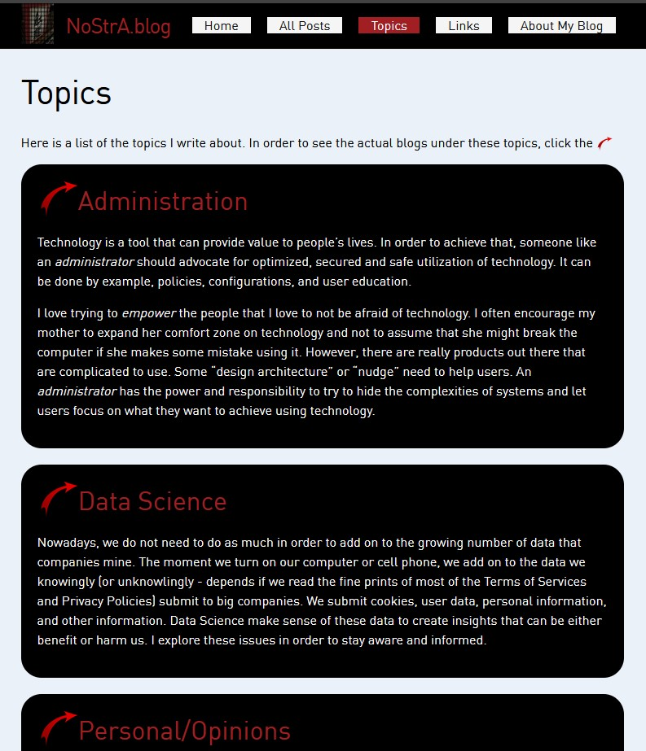

# NostrA.blog - a Jekyll powered site

## Screenshot:

## Objective:

This blog may contain some raw and unfiltered thoughts. I do try to  refine and present my ideas as succinct as I can, but forgive me if I  fail in doing so. The pages of this blog contain topics ranging from:

- Administration

- Data Science

- Programming

- Computer Security

- Web Development

- Personal/Opinions

  

## Tools I used:

This blog is written in Jekyll and is using the default Minima theme. I have overridden the main.css file to alter the theme.

You can find out more info about customizing your Jekyll theme, as well as basic Jekyll usage documentation at [jekyllrb.com](https://jekyllrb.com/)

You can find the source code for Minima at GitHub:
[jekyll][jekyll-organization] /
[minima](https://github.com/jekyll/minima)

You can find the source code for Jekyll at GitHub:
[jekyll][jekyll-organization] /
[jekyll](https://github.com/jekyll/jekyll)

## Links:

[nostra-blog]: https://nostra.dmsx.tech/	"NostrA Blog"

[my-online-portfolio]: https://portfolio.dmsx.tech/	"My Online Portfolio"
[jekyll-organization]: https://github.com/jekyll	"Jekyll Repo"