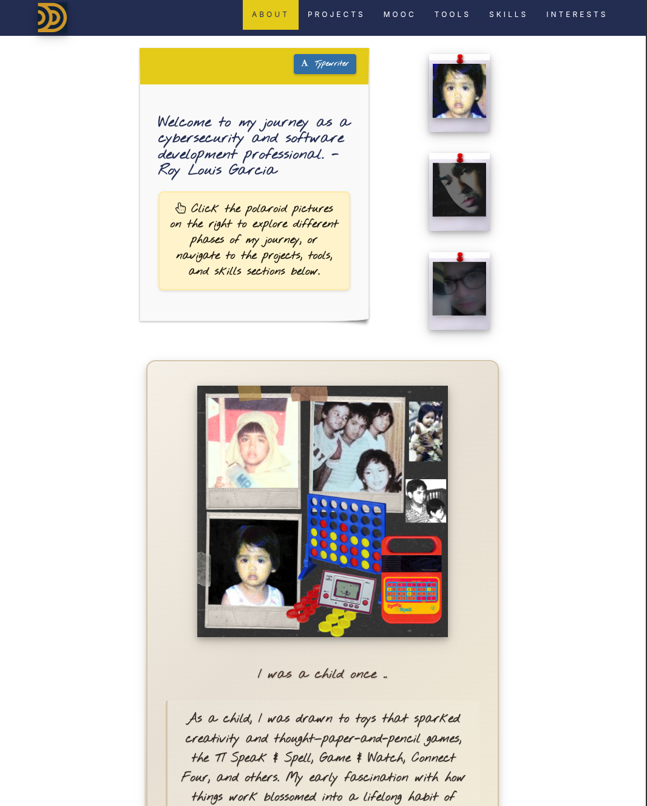
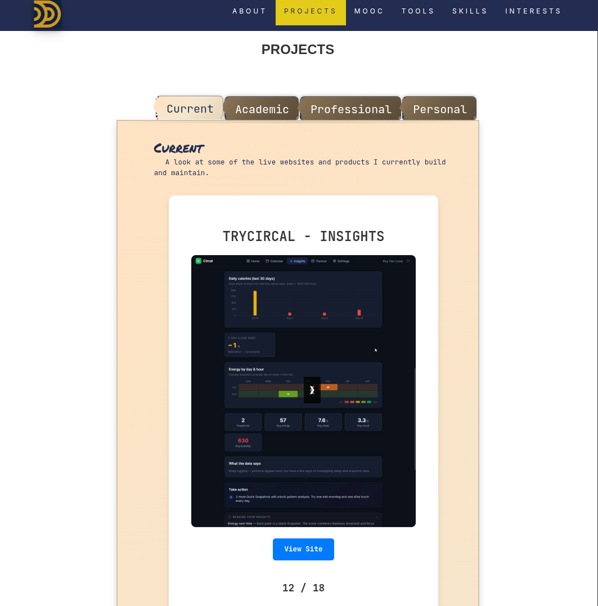
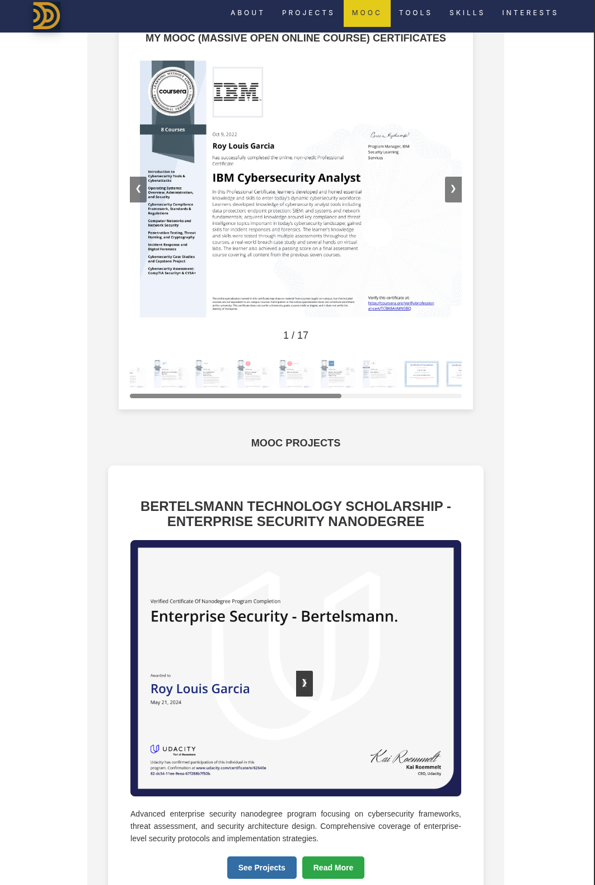
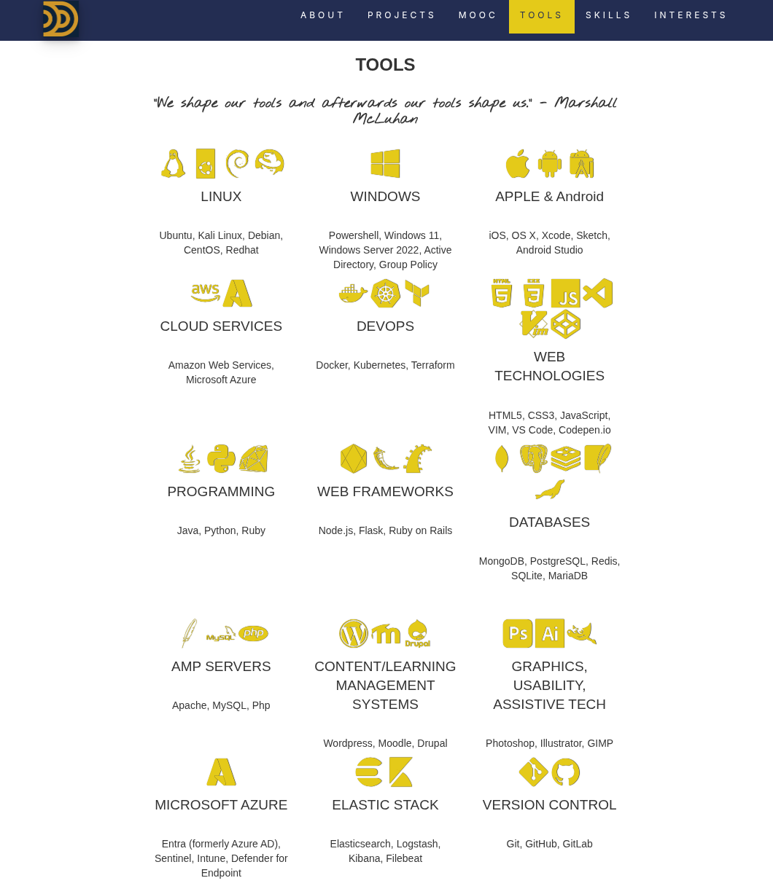
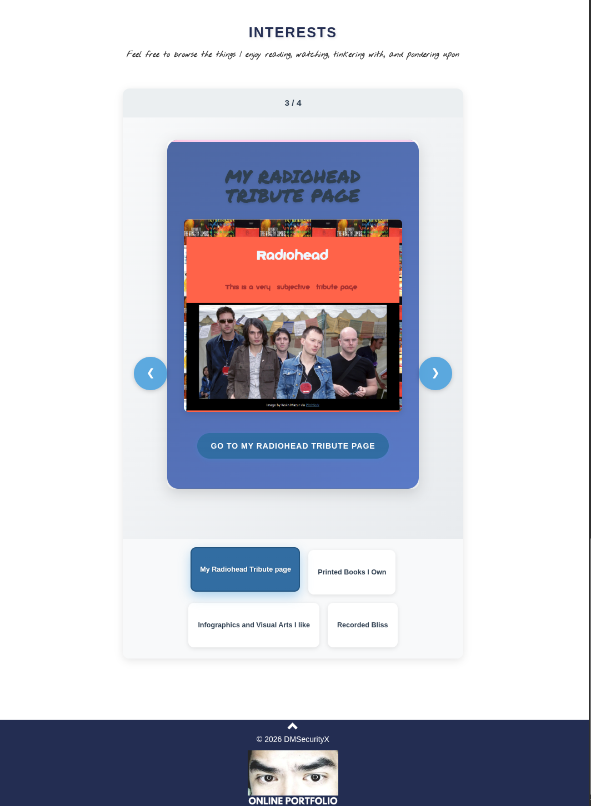

# Roy Louis Garcia — Online Portfolio

A single-page portfolio covering my path from cybersecurity and software development studies to the tools, projects, and interests I keep building on today.

**Live site:** [roy.deliberatelearners.com](https://roy.deliberatelearners.com)

## Screenshots

## From a MOOC deliverable to a site I actually maintain

This portfolio started as a project for FreeCodeCamp's [Responsive Web Design course](https://www.freecodecamp.org/learn/responsive-web-design/responsive-web-design-projects/build-a-personal-portfolio-webpage), built as a single-page application that works on both desktop and mobile. I've kept adding to it since — new sections, new projects, new tools — rather than letting it freeze at "done."

## More from me

This repo is the code behind the portfolio; the sites below are what I actually build and write with it. If you liked what you saw here, this is where to go next:

- **[DeliberateLearners.com](https://deliberatelearners.com)** — my flagship project, starting with Watch and Recall, a tool that locks a learner into producing (not just consuming) so knowledge actually sticks
- **[TryCircal.app](https://trycircal.app)** — an energy-aware calendar that color-codes your day by predicted focus, built from sleep, meals, and body-clock data
- **[MyDigitally.app](https://mydigitally.app)** — a vault to document, protect, and sell your digital assets, with proof-of-ownership verification and estate-planning exports
- **[DMSecurityX.com](https://dmsecurityx.com)** and **[DeliberateCybersecurity.com](https://deliberatecybersecurity.com)** — free, no-jargon security guidance for small businesses and creators
- **[Deliberate-Digital-Legacy.com](https://deliberate-digital-legacy.com)** — helping people secure and pass on their digital lives on purpose
- **[NostradmsX.com](https://nostradmsx.com)** — my build log, where I publish the developer notes and field notes behind all of it
