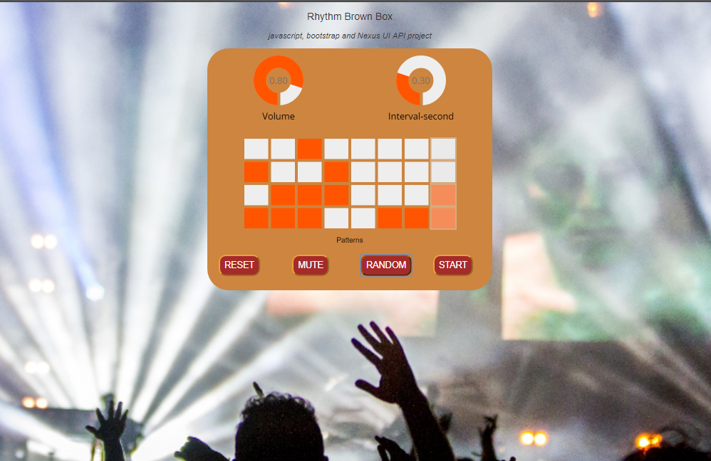

# RhythmBrownBox — Version 1

**Original build (freeCodeCamp era, pre-2026).**
Stack: HTML · CSS · vanilla JS · Web Audio API · NexusUI · Bootstrap 3 — no build step.
License: MPL-2.0.

## What it is

A browser step sequencer built as a portfolio deliverable and then used as a
practice backing track for guitar. Four drum samples (hi-hat, rim, two kicks), an
8-step × 4-track grid, a volume dial and a speed dial.

## How it's built

- One page: `index.html` + `main.css` + `main.js`. No modules, no tooling.
- **Web Audio API** for sound — samples fetched with `XMLHttpRequest` +
  `decodeAudioData`, played through `AudioBufferSourceNode → GainNode →
  destination`.
- **Lookahead scheduler**: a `setInterval` on the main thread wakes every 250 ms
  and schedules the next ~375 ms of hits onto the precise audio clock. The right
  shape — but a main-thread timer is throttled when the tab is backgrounded, so
  the beat drifts.
- **NexusUI** (vendored, 152 KB, no version marker) draws the dials and the
  matrix as `<canvas>` widgets.
- **Bootstrap 3.3.7** grid classes lay out the controls.
- All state is global `var`s (`seq`, `step`, `interval`, `matrix`).

## Controls

Volume · Speed (labelled "Interval-second" — sets seconds-per-step directly, so
turning it up makes the beat *slower*) · Reset · Mute · Random · Start (needed on
iOS to unlock audio).

## Known issues — the reasons v2 exists

- Speed is unitless and inverted; no BPM.
- The pattern isn't saved anywhere; a refresh clears it.
- `stopPlay()` is an empty function and its button is commented out — there is no
  working Stop.
- The main-thread scheduler drifts in a background tab.
- `.headear` CSS typo (the title never gets its rule), `width: 100x` (not a unit,
  so the declaration is dropped), an unclosed `@media` block (browsers auto-close
  it).
- The two kick samples are loaded into swapped variable names.
- Unused includes on every load: jQuery, Bootstrap JS, Font Awesome, devicon (via
  RawGit — shut down in 2019), a key-less Google Maps script.
- The canvas widgets have no keyboard path and nothing a screen reader can
  announce.

## About this copy

Packaged as a single self-contained `index.html` for the portfolio: `main.css`,
`nexusUI.js`, `main.js` and all five assets (4 × `.wav`, `bg.JPG`) are inlined.
**Application code is unchanged.** Two plumbing-only changes:

1. The unused RawGit / Maps / Font Awesome / jQuery / Bootstrap-JS includes are
   dropped (two of them 404 today); Bootstrap's CSS is inlined so the layout
   still works offline.
2. NexusUI bootstraps itself on `setTimeout(fn, 0)`, which in a current browser
   fires before `<body>` is parsed — it finds no `<canvas>` elements and the
   dials and matrix stay blank (the original hosted demo does this now too). The
   two scripts are moved to the end of `<body>` and a small retry shim re-runs
   NexusUI's init once the canvases exist, then hands off. v1's look and
   behaviour are otherwise untouched.
