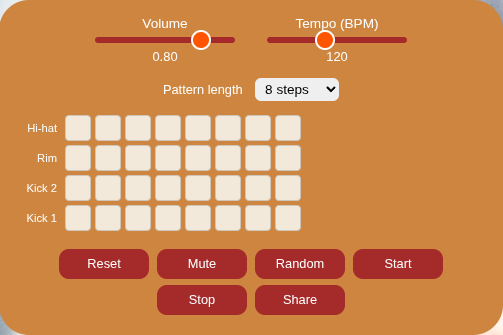

# RhythmBrownBox — Version 2

**Rebuild: August 2026.**
Stack: ES modules · Vite · Vitest · Web Audio API · Web Worker.
License: MPL-2.0. Runtime dependencies: none.

## What it is

A ground-up rebuild of v1, driven by a code audit and an agile / BDD / TDD
backlog. Same idea — a browser drum machine to practice against — but with real
tempo, saved patterns, a working transport, keyboard and screen-reader access,
and no third-party code.

## What changed from v1

| | v1 | v2 |
|---|---|---|
| Tempo | "Interval-second" float, inverted | BPM 40–240, unit-tested conversion (`tempo.js`) |
| Pattern length | fixed 8 | 8 / 16 / 32 steps (`pattern.js`) |
| Tracks | 4 | 5 — hi-hat, rim, **snare**, kick 2, kick 1 |
| Persistence | none | autosave to `localStorage` + shareable URL (`persistence.js`) |
| Stop | empty function | real stop; Start resumes from step 0 |
| Scheduler | `setInterval` on the main thread, drifts | pure `stepsToFire()` (`scheduler.js`) driven by a Web Worker timer — no background-tab drift |
| UI | NexusUI `<canvas>` widgets, mouse only | native `<input type="range">` + a real `<button>` grid; full keyboard + ARIA |
| Dependencies | NexusUI, Bootstrap, jQuery, Font Awesome… | none — ~6 KB of own JS |
| Tests / CI | none | 16 unit tests (Vitest); GitHub Actions runs lint + test + build |

## How it's built

- `src/` ES modules, bundled by **Vite**. The pure logic (`scheduler`, `tempo`,
  `pattern`, `persistence`) is split out and unit-tested with **Vitest**;
  DOM/audio behaviour is written up as Gherkin `.feature` files.
- **Two-clock scheduling** (Chris Wilson, *A Tale of Two Clocks*): a coarse timer
  in a **Web Worker** wakes periodically and schedules the next window of steps
  onto the sample-accurate `AudioContext` clock. A Worker timer isn't throttled
  when the tab is hidden, which is what fixes v1's drift.
- Samples are `import`ed as assets and the worker is built `?worker&inline`, so
  the one source produces both a normal multi-file `dist/` and a single
  self-contained `dist-single/index.html`.
- The saved-pattern format is versioned; adding the snare bumped it so older
  4-row saves fall back to an empty grid instead of loading a row short.

## Controls

Volume · Tempo (BPM) · Pattern length · the step grid (click, or Tab / arrow
keys + Space) · Reset · Mute · Random · Start · Stop · Share.

## About this copy

The single-file build — all JS, CSS, the Worker, five `.wav` samples and the
background inlined into one `index.html` that runs from `file://` or any static
host, no build step.

## Still open (candidates for v3)

A full roving-tabindex ARIA grid (today every cell is its own tab stop), swing,
and per-track pattern lengths for polymeter. None of these block calling the
rebuild done.
